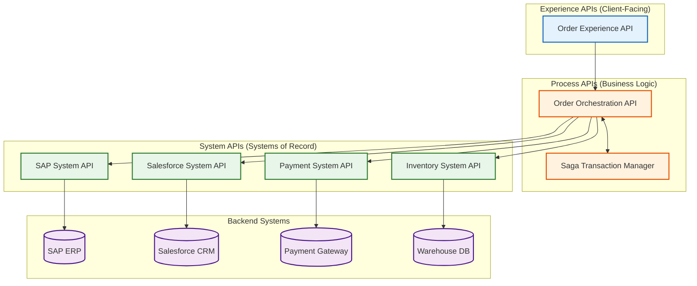

<div align="center">

# 🚀 MuleSoft Enterprise Integration Platform

### **Order-to-Cash · API-Led Connectivity · Mule 4**

[](https://github.com/Goutham3369/mulesoft-enterprise-integration-platform/actions)
[](LICENSE)
[](https://www.mulesoft.com/)
[](https://openjdk.org/)
[](https://maven.apache.org/)

---

**Enterprise-grade MuleSoft integration platform implementing API-Led Connectivity for Order-to-Cash operations.** 
Orchestrates SAP ERP, Salesforce CRM, Payment Gateway, and Inventory Management systems through a robust three-layer API architecture featuring saga-based distributed transactions, comprehensive error handling, and real-time monitoring.

[📖 Architecture](docs/architecture.md) · [🚢 Deployment](docs/deployment-guide.md) · [📡 API Catalog](docs/api-catalog.md)

</div>

---

The MuleSoft Enterprise Integration Platform (EIP) I built here is a fully-fledged integration solution that implements MuleSoft's **API-Led Connectivity** pattern. It orchestrates an Order-to-Cash process across multiple systems (SAP, Salesforce, Stripe, and a WMS).



---

## 📦 Delivered Components Overview

| Component | Purpose | Location |
| :--- | :--- | :--- |
| **API Specifications** | Standardized RAML 1.0 Contracts with Pagination, Error Traits | `api-specs/` |
| **Experience Layer** | Client-facing endpoints optimized for Mobile and Web | `experience-apis/` |
| **Process Layer** | Aggregation logic, Customer 360, and Saga orchestrations | `process-apis/` |
| **System Layer** | Dedicated CRUD integrations for SAP, Salesforce, and Stripe | `system-apis/` |
| **Shared Libraries** | Global error handlers, JSON logging, and security flows | `shared-libraries/` |

> [!NOTE]
> All APIs are scaffolded using the APIkit Router, enforcing the RAML contracts automatically upon execution.

---

## 📊 Premium Web Dashboard

To provide real-time visibility into the integration platform, this repository includes a modern, responsive web dashboard built with a sleek glassmorphism aesthetic.

> [!IMPORTANT]
> **Experience the UI**
> You can launch the dashboard locally by opening the `dashboard/index.html` file in any modern web browser. It features live simulated telemetry, API health metrics, and an interactive Order-to-Cash process visualization.

---

## ⚙️ Quick Start Guide

### 1️⃣ Clone the Repository
```bash
git clone https://github.com/Goutham3369/mulesoft-enterprise-integration-platform.git
cd mulesoft-enterprise-integration-platform
```

### 2️⃣ Build All Modules
```bash
mvn clean install -DskipTests
```

### 3️⃣ Start Local Infrastructure (Optional)
A `docker-compose.yml` file is provided to instantly spin up **ActiveMQ** (for JMS messaging), **Prometheus**, and **Grafana** for local telemetry.
```bash
docker compose up -d
```

### 4️⃣ Deploy to Anypoint Studio
Import the Maven projects directly into Anypoint Studio 7.x to run the flows and view the visual drag-and-drop interfaces locally.

---

## 🛡️ Security Architecture

| Control | Implementation |
|:--------|:---------------|
| 🔑 **Authentication** | OAuth 2.0 Client Credentials for API-to-API; JWT Bearer for the experience layer. |
| 🛡️ **Authorization** | Anypoint API Manager policies providing strict role-based access control. |
| 🌐 **Encryption** | TLS 1.3 mutual authentication enforced between all API layers. |
| 🚫 **Rate Limiting** | Tiered SLA limits (e.g., Free: 100/hr, Premium: 10000/hr) configured at the API Gateway. |

---

## 🤝 Contributing

We welcome contributions! Please follow standard Git Flow:
1. Fork the repository
2. Create your feature branch (`git checkout -b feature/amazing-feature`)
3. Commit your changes (`git commit -m 'feat: add amazing feature'`)
4. Push to the branch (`git push origin feature/amazing-feature`)
5. Open a Pull Request

---

<div align="center">

**Built with ❤️ using MuleSoft Anypoint Platform**

</div>
