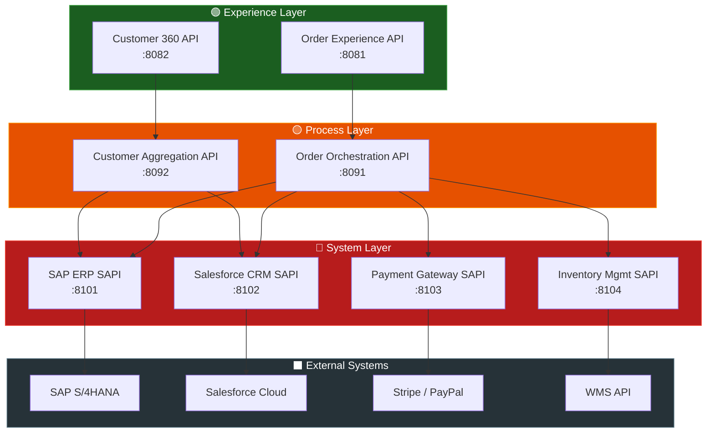

# 🏗️ Architecture Documentation

### **MuleSoft Enterprise Integration Platform — Order-to-Cash**

---

> [!TIP]
> **Executive Overview**
> The MuleSoft Enterprise Integration Platform is a production-grade integration solution that implements MuleSoft's **API-Led Connectivity** pattern to orchestrate Order-to-Cash business operations across multiple enterprise systems.

## 📋 Table of Contents

- [System Overview](#system-overview)
- [API-Led Connectivity Pattern](#api-led-connectivity-pattern)
- [Component Architecture](#component-architecture)
- [Data Flow Diagrams](#data-flow-diagrams)
- [Saga Pattern for Distributed Transactions](#saga-pattern-for-distributed-transactions)
- [Error Handling Strategy](#error-handling-strategy)
- [Security Architecture](#security-architecture)

---

## 🏛️ System Overview

### Design Principles

| Principle | Description |
|:----------|:------------|
| **Separation of Concerns** | Each API layer has a distinct responsibility — no layer leaks logic to another |
| **Reusability** | System APIs are reusable building blocks consumed by multiple process APIs |
| **Discoverability** | All APIs are published to Anypoint Exchange with RAML 1.0 specifications |
| **Resilience** | Circuit breakers, retry policies, and saga compensation ensure fault tolerance |
| **Observability** | Every request carries a correlation ID through all layers for end-to-end tracing |
| **Security by Default** | All inter-layer communication is authenticated, authorized, and encrypted |

### Technology Stack

| Component | Technology | Version |
|:----------|:-----------|:--------|
| Runtime | Mule 4 (EE) | 4.6.0 |
| Language | DataWeave 2.0 | — |
| API Spec | RAML 1.0 | — |
| Build | Apache Maven | 3.9+ |
| JDK | OpenJDK | 17 |
| Messaging | Apache ActiveMQ | 5.18 |

---

## 🔗 API-Led Connectivity Pattern

API-Led Connectivity organizes APIs into three distinct layers, each with a specific purpose:

> [!IMPORTANT]
> **Strict Layering Enforced**
> Experience APIs can NEVER directly call System APIs or external systems. They must always route through the Process layer to ensure business logic remains centralized.

---

## 🧩 Component Architecture

### System Layer APIs

| API | Backend | Key Features |
|:---|:---|:---|
| **SAP ERP SAPI** | SAP S/4HANA (RFC/BAPI) | Protocol translation (RFC/BAPI → REST), Error Mapping |
| **Salesforce SAPI**| Salesforce Cloud | Bulk API 2.0, OAuth 2.0 JWT Bearer flow |
| **Payment SAPI** | Stripe / PayPal | Idempotency keys, webhook signature verification |
| **Inventory SAPI** | WMS REST API | Real-time stock checks, async reservations via JMS |

### Process Layer APIs

| API | Pattern | Key Features |
|:---|:---|:---|
| **Order Orchestration**| Saga Orchestrator | Distributed rollback, async step processing |
| **Customer Aggregation**| Scatter-Gather | Parallel data fetching, ObjectStore caching (5m TTL) |

---

## 🔄 Data Flow Diagrams

### Order-to-Cash Flow (Saga Pattern)

```mermaid
sequenceDiagram
    participant Client as 🌐 Client App
    participant EXP as 🟢 Order Experience API
    participant PROC as 🟡 Order Orchestration API
    participant SAP as 🔴 SAP ERP SAPI
    participant PAY as 🔴 Payment Gateway SAPI
    participant INV as 🔴 Inventory Mgmt SAPI
    participant Q as 📨 JMS Queue

    Client->>+EXP: POST /api/v1/orders
    Note over EXP: Validate Token & Rate Limit

    EXP->>+PROC: POST /api/v1/orders/orchestrate
    Note over PROC: Generate Saga ID

    rect rgb(40, 60, 40)
        PROC->>+INV: POST /api/v1/reservations
        INV-->>-PROC: 201 Reservation confirmed
    end

    rect rgb(40, 40, 60)
        PROC->>+PAY: POST /api/v1/payments
        PAY-->>-PROC: 201 Payment authorized
    end

    rect rgb(60, 40, 40)
        PROC->>+SAP: POST /api/v1/orders
        SAP-->>-PROC: 201 SAP Order created
    end

    PROC->>Q: Publish order.confirmed event
    PROC-->>-EXP: 201 Order created
    EXP-->>-Client: 201 Order confirmation
```

---

## 🛡️ Security Architecture

> [!WARNING]
> **Zero Trust Network**
> All APIs enforce strict authentication. Do not expose Process or System APIs directly to the public internet; they must reside within an Anypoint VPC.

| Layer | Authentication | Authorization | Encryption |
|:------|:--------------|:-------------|:-----------|
| **External → Experience** | OAuth 2.0 / JWT Bearer | API Manager Policies (RBAC) | TLS 1.3 |
| **Experience → Process** | OAuth 2.0 Client Credentials | Anypoint autodiscovery | mTLS |
| **Process → System** | OAuth 2.0 Client Credentials | Anypoint autodiscovery | mTLS |
| **System → Backend** | System-specific (RFC, OAuth) | Backend ACLs | TLS 1.2+ |
| **Properties** | — | — | AES-256 Secure Properties |

---

<i>Last updated: June 2026 | Built for MuleSoft Enterprise Architecture</i>

